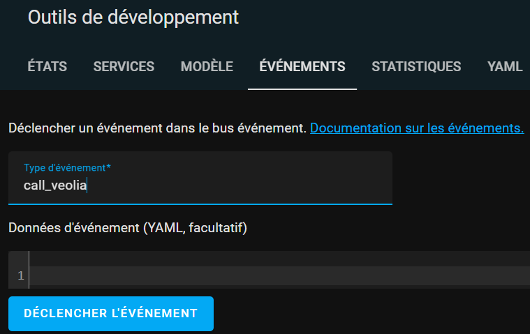
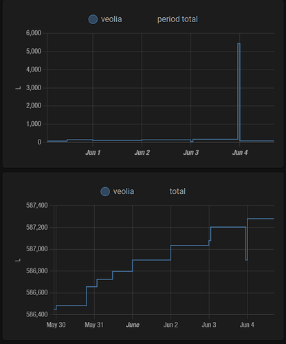

# Documentation spécifique pour Home Assistant avec AppDaemon et HACS

<!-- mdformat-toc start --slug=github --no-anchors --maxlevel=4 --minlevel=1 -->

- [Documentation spécifique pour Home Assistant avec AppDaemon et HACS](#documentation-sp%C3%A9cifique-pour-home-assistant-avec-appdaemon-et-hacs)
  - [Informations générales](#informations-g%C3%A9n%C3%A9rales)
  - [Le fichier de configuration (`config.json`)](#le-fichier-de-configuration-configjson)
  - [Installation AppDaemon](#installation-appdaemon)
  - [Ajouter `veolia-idf` à l'AppDaemon avec HACS](#ajouter-veolia-idf-%C3%A0-lappdaemon-avec-hacs)
    - [Configuration](#configuration)
  - [Débogue](#d%C3%A9bogue)
    - [Lancer l’appel à Veolia](#lancer-l%E2%80%99appel-%C3%A0-veolia)
    - [Aotomatisation Home Assistant](#aotomatisation-home-assistant)

<!-- mdformat-toc end -->

## Informations générales

Le dépôt [mdeweerd/veolia-idf](https://github.com/mdeweerd/veolia-idf)
reorganise [sOnik42/veolia-idf](https://github.com/s0nik42/veolia-idf)
comme une application
[AppDaemon](https://appdaemon.readthedocs.io/en/latest/INSTALL.html) sous
Home Assistant.

Pour faciliter l'installation avec [HACS](https://hacs.xyz/), les scripts
sont placés dans le répertoire `apps/veolia_idf` auquel est ajouter
`veolia_idf.py` qui assure l'intégration sous AppDaemon.

Ce script fonctionne exclusivement avec le site
[https://www.vedif.eau.veolia.fr](https://www.vedif.eau.veolia.fr/) valable
pour Veolia en IDF. Vous pouvez trouver votre portail en fonction de la
ville en visitant
[https://www.eau.veolia.fr/ 1](https://www.eau.veolia.fr/) > CONNECTEZ-VOUS
. .

## Le fichier de configuration (`config.json`)

Dans tous les cas il faut un fichier de configuration. Pour Home Assistant,
le point de départ peut être `config.json.exemple.home-assistant` que vous
renommez en `config.json` (ou autre).

Exemple:

```json
{
  "veolia_login": "MONLOGIN",
  "veolia_password": "MONPASSE",
  "veolia_contract": "MONCONTRAT",
  "ha_server": "https://MONINSTANCEHA",
  "ha_token": "MONTOKEN",
  "type": "ha",
  "timeout": "30"
}
```

## Installation AppDaemon

1. [Ajouter le AddON/Module complémentaire « Home Assistant Community Add-on: AppDaemon »](https://appdaemon.readthedocs.io/en/latest/INSTALL.html)
   selon votre système, ou
   [suivez ces instructions pour HAOS](https://my.home-assistant.io/redirect/supervisor_store/)
   ou aller directement vers le lien (en remplaçant 'VOTREINSTANCE'):
   `VOTREINSTANCE/hassio/addon/a0d7b954_appdaemon/info` , puis « Install »
2. Pour HAOS (et peut-être d’autres), configurer `AppDaemon` au moins avec
   ces paquets (configuration au format `yaml` pour HAOS):

```yaml
init_commands: []
python_packages:
  - selenium
  - PyVirtualDisplay
system_packages:
  - py-urllib3
  - py3-colorama
  - xvfb
  - py3-pip
  - xorg-server-xephyr
  - chromium-chromedriver
  - chromium
  - py3-openssl
  - py3-pysocks
  - py3-wsproto
  - py3-sniffio
  - py3-async_generator
  - py3-sortedcontainers
  - py3-attrs
  - py3-outcome
  - py3-trio
```

- Activer le Watchdog du AddOn, Démarrer le AddOn

## Ajouter `veolia-idf` à l'AppDaemon avec HACS

Cette procédure suppose que HACS est déjà actif et configuré pour
`AppDaemon`. Ainsi que `AppDaemon` soit activé.

1. Ajouter
   [GitHub - mdeweerd/veolia-idf: Charge l'historique de votre consommation Veolia Ile de France dans Domoticz 1](https://github.com/mdeweerd/veolia-idf)
   comme source de type AppDaemon:


Note : après l’ajout, le popup reste affiché. Le nouveau module est
disponible à la fin de la liste:


2. Ensuite « télécharger » ce dépôt avec HACS - chercher `veolia_idf` parmi
   les « AppDaemons » et cliquez Télécharger ou Download:

   

Les scripts sont ainsi disponibles pour AppDaemon.

### <a id="configuration-4"></a>[](#configuration-4)Configuration

Reste encore la configuration de `veolia_idf` sous AppDaemon. Plus haut la
création du fichier `config.json` a été expliquée. Vous devez le déposer
sur votre instance Home Assistant, de préférence dans un sous-répertoire de
`.../config`.

Dans l'exemple ci-dessous il est supposé que ce fichier `config.json` est
disponible au chemin `/config/veolia-idf/config.json`.

Cette configuration indique aussi que la trace `veolia.log` sera déposé
sous `/config`. Le fichier `/config/veolia.log` pourra aider à identifier
des causes de dysfonctionnement.

Voici un exemple d'une configuration minimale à ajouter à
`/config/appdaemon/apps/apps.yaml`:

```yaml
veolia_idf:
  module: veolia_idf
  class: VeoliaIDF
  config_file: /config/config.json
```

L'exemple suivant montre l'ensemble des arguments disponibles, dont la
précision du chemin vers le script `veolia-idf-domoticz.py`.

```yaml
veolia_idf:
  module: veolia_idf
  class: VeoliaIDF
  # optional
  log_folder: /config
  # optional (Default: "config.json" in directory of `veolia-idf-domoticz.py`)
  config_file: /config/veolia-idf/config.json
  # optional (Default: "<REALMODULESCRIPTPATH>/veolia-idf-domoticz.py")
  script: /config/veolia-idf/veolia-idf-domoticz.py
```

## Débogue

Pour info, il y a une interface web spécifique à AppDaemon :
[http://votreinstance:5050](http://votreinstance:5050/) qui donne entre
outre accès à qqs traces et l’historique des appels de scripts.

### Lancer l’appel à Veolia

L’appel est lancé en déclenchant l’événement `call_veolia`. Cela peut être
fait dans une automatisation (ce qui permet de le lancer selon un planning
par exemple), ou de façon interactive dans les outils de développement:



Une trace est systématiquement créé comme « veolia.log », soit à
l’emplacement du script, soit dans le répertoire donné par `log_folder:` .
Cela peut déjà aider à identifier les causes, ou tout simplement le bon
déroulement du script.

Comme par exemple:

```plaintext
2022-06-01 18:31:55,541 : -- :  Parsing csv file
2022-06-01 18:31:55,813 : OK : update value for 2022-05-31
2022-06-01 18:31:56,014 : OK : Close Browser
2022-06-01 18:31:56,018 : OK : Close Display
2022-06-01 18:31:56,019 : -- : Remove downloaded file historique_jours_litres.csv Finished on success
```

### Aotomatisation Home Assistant

Pour réaliser la tache de récupération une fois par jour, vous pouvez
ajouter un automatisme à votre configuration Home Assistant comme ceci:

```yaml
alias: Veolia
description: ''
trigger:
  - platform: time_pattern
    hours: '1'
    minutes: '7'
condition: []
action:
  - event: call_veolia
    event_data: {}
mode: single
```

Cela récupère la consommation à 1h07.

Il semblerait que les données restitués par Veolia sont des fois un peu
"farfelus". La meilleure méthode connue pour éviter cela est de
contournement c'est de réaliser l'appel à partir de 1h du matin seulement
et avant minuit.

Mettez SVP une heure différente de 1h07 dans votre configuration afin de
répartir les appels auprès de Veolia. Vous pouvez sûrement accepter de
récuperer l'information un peu plus tard que cela vu qu'elle est de tout
façon déjà décalé de qqs jousr.

Voici un exemple d'une récupération pour une journée partielle:


Et voici un exemple de données "farfelus" (les 5400L de conso journalière
sont inexactes).


