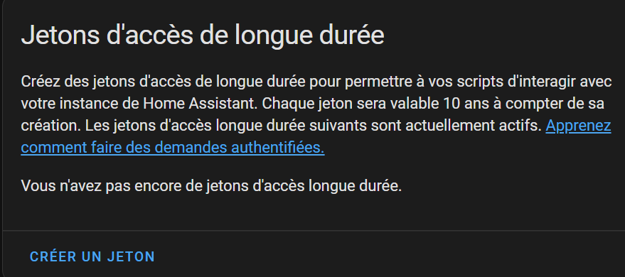
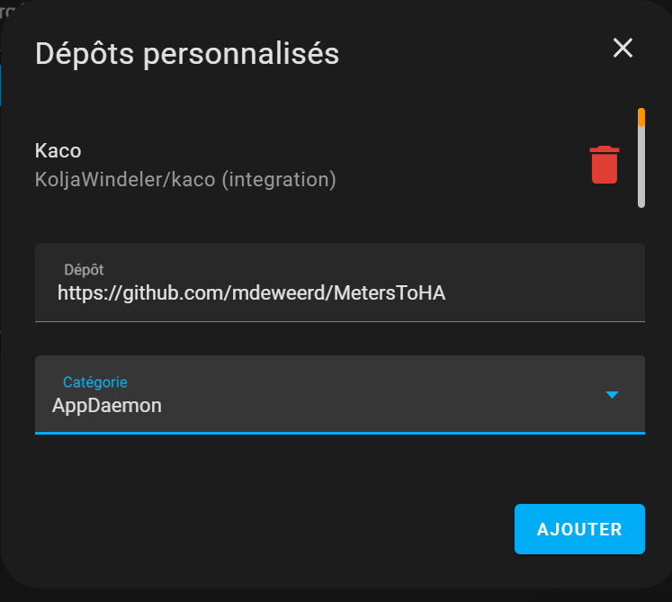
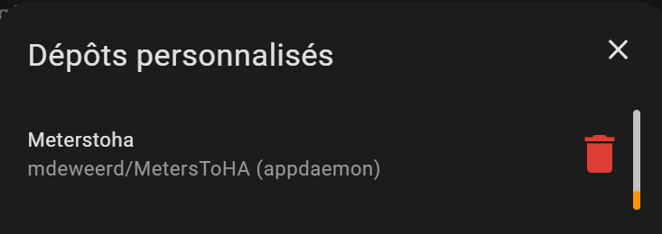
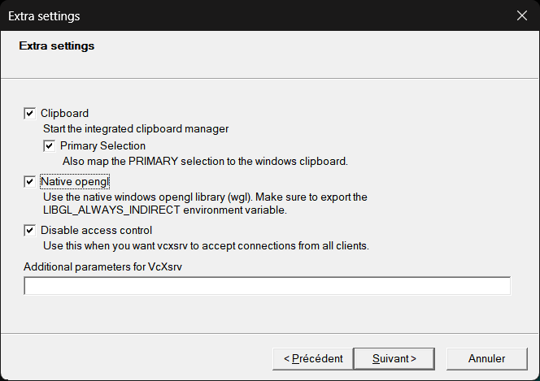

# Meters To Home Automation (MetersToHA / Meters2HA / M2HA)

Ce script automatise le transfert de l'information de consommation d'eau et
de gaz vers des systèmes domotiques tels que
[Home Assistant](https://www.home-assistant.io/) et
[Domoticz](https://domoticz.com/).

Ceci est la documentation spécifique pour Home Assistant avec AppDaemon et
HACS. C'est un fork de [veolia-idf](https://github.com/s0nik42/veolia-idf).

## Fonctionnalités :

- Récupération des valeurs de consommation au fil du temps;
- Gestion multi-contrat
- Vérification de l'intégrité de l'environnement (prérequis / configuration
  sur serveur domotique)
- Mode débugue graphique
- Possible intégration avec d'autre solution domotique (à vous de jouer)

## Table des Matières

<!-- mdformat-toc start --slug=github --no-anchors --maxlevel=4 --minlevel=1 -->

- [Meters To Home Automation (MetersToHA / Meters2HA / M2HA)](#meters-to-home-automation-meterstoha--meters2ha--m2ha)
  - [Fonctionnalités :](#fonctionnalit%C3%A9s-)
  - [Table des Matières](#table-des-mati%C3%A8res)
  - [:warning: Limitations](#warning-limitations)
  - [Informations générales](#informations-g%C3%A9n%C3%A9rales)
  - [Le fichier de configuration (`config.json`)](#le-fichier-de-configuration-configjson)
  - [Home Assistant](#home-assistant)
    - [Configuration](#configuration)
    - [AppDaemon](#appdaemon)
      - [Installation AppDaemon](#installation-appdaemon)
      - [Ajouter `MetersToHA` à l'AppDaemon avec HACS](#ajouter-meterstoha-%C3%A0-lappdaemon-avec-hacs)
      - [Configuration MetersToHA sous AppDaemon](#configuration-meterstoha-sous-appdaemon)
      - [Débogue avec AppDaemon](#d%C3%A9bogue-avec-appdaemon)
      - [Lancer un appel à Veolia (AppDaemon)](#lancer-un-appel-%C3%A0-veolia-appdaemon)
      - [GRDF (AppDaemon)](#grdf-appdaemon)
      - [Automatisation Home Assistant (AppDaemon)](#automatisation-home-assistant-appdaemon)
    - [Ajout des informations au tableau "Énergie"](#ajout-des-informations-au-tableau-%C3%A9nergie)
  - [Domoticz](#domoticz)
    - [Création du "Virtual Sensor" sur Domoticz :](#cr%C3%A9ation-du-virtual-sensor-sur-domoticz-)
    - [Spécificités de configuration](#sp%C3%A9cificit%C3%A9s-de-configuration)
  - [Fournisseurs](#fournisseurs)
    - [Veolia](#veolia)
    - [GRDF](#grdf)
  - ["Serveurs" Linux](#serveurs-linux)
    - [Docker - "configuration système incluse"](#docker---configuration-syst%C3%A8me-incluse)
    - [Installation "direct"](#installation-direct)
    - [Installation avec le sous-système Windows pour Linux (WSL)](#installation-avec-le-sous-syst%C3%A8me-windows-pour-linux-wsl)
    - [Installation de MetersToHA](#installation-de-meterstoha)
      - [Installation avec `git`](#installation-avec-git)
      - [Installation avec une archive](#installation-avec-une-archive)
    - [Automatisation :](#automatisation-)
  - [Dépannage](#d%C3%A9pannage)
    - [Première exécution :](#premi%C3%A8re-ex%C3%A9cution-)
    - [Paramétrer votre système pour le mode débogue (optionnel, mais recommandé)](#param%C3%A9trer-votre-syst%C3%A8me-pour-le-mode-d%C3%A9bogue-optionnel-mais-recommand%C3%A9)
  - [Principe de fonctionnement](#principe-de-fonctionnement)
  - [Environnements testés:](#environnements-test%C3%A9s)
  - [Remerciements/Contributeurs](#remerciementscontributeurs)

<!-- mdformat-toc end -->

## :warning: Limitations

- GRDF n'est pas encore compatible avec Domoticz;
- GRDF nécessite un service de résolution de captcha payant.

## Informations générales

En résumé, il y a 4 étapes pour la mise en place:

1. Installation sur un "serveur" Linux:

- Distribution classique: Debian, Ubuntu, Alpine, etc. - physique ou
  Machine Virtuelle (VM);
- Docker - conteneurisation;
- Debian/Ubuntu avec le sous-système Windows pour Linux (WSL);
- Au sein/en parallèle de votre système domotique (AppDaemon pour Home
  Assistant par exemple).

2. Configuration de MetersToHA - Fichier `config.json` avec les logins,
   etc.

3. Mise au point (essais, correction de configuration).

4. Automatisation (exécution régulière du script).

Ce document continue avec l'explication de la configuration: c'est commun à
toutes les installations.\
Ensuite il explique comment l'utiliser avec le
système domotique.\
Et au final il aborde les environnements
d'exécution/installation.

Ce script fonctionne pour:

- [Veolia IDF - https://www.vedif.eau.veolia.fr](https://www.vedif.eau.veolia.fr/)
  valable pour Veolia en IDF.\
  Vous pouvez trouver votre portail en
  fonction de la ville en visitant
  [https://www.eau.veolia.fr](https://www.eau.veolia.fr/)> CONNECTEZ-VOUS .
- [GRDF - https://monespace.grdf.fr](https://monespace.grdf.fr/client/particulier/accueil).

## Le fichier de configuration (`config.json`)

Dans tous les cas il faut un fichier de configuration. Pour Home Assistant,
le point de départ peut être `config.json.exemple.home-assistant` que vous
renommez en `config.json` (ou autre).

Exemple de configuration:

```json
{
  "veolia_login": "MON_LOGIN_VEOLIA@mon.domaine",
  "veolia_password": "MONPASSEVEOLIA",
  "veolia_contract": "MONCONTRATVEOLIA",
  "grdf_login": "MON_LOGIN_GRDF@mon.domaine",
  "grdf_password": "XXXXXXXXXXXX",
  "grdf_pce": "21546000000000",
  "ha_server": "https://MONINSTANCEHA",
  "ha_token": "MONTOKEN.XXXXXXX.XXXXX-XXXXXXX",
  "2captcha_token": "XXXXXXXXXXX",
  "type": "ha",
  "timeout": "30"
}
```

Les fournisseurs consultables dépendent des paramètres renseignés.

Explication des champs:

- `veolia_login`, `veolia_password`: `veolia_contract`:\
  Les informations
  de login sur le site de Veolia IDF, et le numéro de votre
  contrat.\
  Seulement pour Veolia Ile-de-France.
- `grdf_login`, `grdf_password`, `grdf_pce`: Les informations de login sur
  le site de GRDF. L'identification du Point de Comptage et Estimation
  (PCE) est optionnel (actuellement).\
  Seulement pour GRDF.
- `ha_server`: le domaine + le port accessibles depuis là ou le script
  tourne.\
  Cela peut être
  [http://homeassistant.local:8123](http://homeassistant.local:8123) dans
  le cas ou vous n'avez pas touché la configuration réseau.
- `ha_token`: voir ci-dessous, permets d'accéder à Home Assistant depuis le
  script.\
  Seulement pour Home Assistant
- `2captcha_token`: à obtenir sur
  [2captcha.com](https://2captcha.com/?from=16639177).\
  Seulement si vous
  souhaitez résoudre les captchas automatiquement (GRDF, sinon vous devez
  utiliser --debug qui nécessite un serveur
  X).\
  [capmonster.cloud](https://capmonster.cloud/) a été intégré sans
  être testé.\
  Un débat assez complet concernant ce type de service est
  dans
  [cet issue d'un autre projet](https://github.com/iv-org/invidious/issues/1256).
  Inutile d'ouvrir un issue de débat ici, sauf pour proposer une
  alternative s'appuyant (moins) sur l'humain.\
  Pour Veolia, vous n'avez
  pas besoin de ce service.
- `type`: "ha" pour Home Assistant, "domoticz" pour Domoticz (à terme
  "mqtt", "file" par exemple).
- `timeout`: Le délai en secondes que le script attend pour certaines
  étapes.

Ne mettez que les valeurs utiles. Si vous consultez seulement Veolia IDF,
ceci suffit:

```json
{
  "veolia_login": "MON_LOGIN_VEOLIA@mon.domaine",
  "veolia_password": "MONPASSEVEOLIA",
  "veolia_contract": "MONCONTRATVEOLIA",
  "ha_server": "https://MONINSTANCEHA",
  "ha_token": "MONTOKEN.XXXXXXX.XXXXX-XXXXXXX",
  "type": "ha",
  "timeout": "30"
}
```

## Home Assistant

En sus des informations qui suivent,
[Le forum HACF](https://forum.hacf.fr/t/veolia-idf-sedif-consommation-eau-potable-suivi-consommation/11492)
peut également vous aider.

### Configuration

La valeur pour `ha_token` est nécessaire et peut être obtenu dans
[son profil Home Assistant](https://my.home-assistant.io/redirect/profile/).
Cette fonctionnalité est disponible tout en bas de la page en question ou
il faut cliquer "Créer un jeton":



### AppDaemon

L'installation avec
[AppDaemon](https://appdaemon.readthedocs.io/en/latest/INSTALL.html) semble
le plus approprié si vous avez HomeAssistant OS (HAOS) puisque tout
tournera sur la même machine (moyennant à peu près 500Mo pour installer
AppDaemon et les paquets).\
Vous pouvez tout aussi bien utiliser les autres
environnements.

Une fois AppDaemon installé, vous pourez ajouter MetersToHA
[HACS](https://hacs.xyz/). Les scripts sont placés dans le répertoire
`../config/appdaemon/apps/meters-to-ha`. Le fichier
`meters-to-ha-appdaemon.py` assure l'intégration sous AppDaemon.
`meters_to_ha.py` est le script indépendant et commun à toute installation.

#### Installation AppDaemon

1. [Ajouter le AddON/Module complémentaire « Home Assistant Community Add-on: AppDaemon »](https://appdaemon.readthedocs.io/en/latest/INSTALL.html)
   selon votre système, ou
   [suivez ces instructions pour HAOS](https://github.com/hassio-addons/addon-appdaemon/blob/main/appdaemon/DOCS.md#installation)
   ou aller directement vers le lien (en remplaçant 'VOTREINSTANCE'):
   `VOTREINSTANCE/hassio/addon/a0d7b954_appdaemon/info` , puis « Install »
2. Pour HAOS (et peut-être d’autres), configurer `AppDaemon` au moins avec
   ces paquets (configuration au format `yaml` pour HAOS):

```yaml
init_commands: []
python_packages:
  - selenium
  - PyVirtualDisplay
system_packages:
  - py-urllib3
  - py3-colorama
  - xvfb
  - py3-pip
  - xorg-server-xephyr
  - chromium-chromedriver
  - chromium
  - py3-openssl
  - py3-pysocks
  - py3-wsproto
  - py3-sniffio
  - py3-async_generator
  - py3-sortedcontainers
  - py3-attrs
  - py3-outcome
  - py3-trio
```

- Activer le Watchdog du AddOn, Démarrer le AddOn

#### Ajouter `MetersToHA` à l'AppDaemon avec HACS

Cette procédure suppose que HACS est déjà actif et configuré pour
`AppDaemon`. Ainsi que `AppDaemon` soit activé.

1. Ajouter
   [GitHub - mdeweerd/MetersToHA](https://github.com/mdeweerd/MetersToHA)
   comme source de type AppDaemon:

   

   Note : après l’ajout, le popup reste affiché. Le nouveau module est
   disponible à la fin de la liste:

   

2. Ensuite « télécharger » ce dépôt avec HACS - chercher `meterstoha` parmi
   les « AppDaemons » et cliquez Télécharger ou Download:

   

Les scripts sont ainsi disponibles pour AppDaemon.

#### Configuration MetersToHA sous AppDaemon

Reste encore la configuration de `MetersToHA` sous AppDaemon. Plus haut la
création du fichier `config.json` a été expliquée. Vous devez le déposer
sur votre instance Home Assistant, de préférence dans un sous-répertoire de
`.../config`.

Dans l'exemple ci-dessous il est supposé que ce fichier `config.json` est
disponible au chemin `/config/config.json`.

Cette configuration indique aussi que la trace `veolia.log` sera déposé
sous `/config`. Le fichier `/config/veolia.log` pourra aider à identifier
des causes de dysfonctionnement.

Voici un exemple d'une configuration minimale à ajouter à
`/config/appdaemon/apps/apps.yaml` - l'évenement déclencheur est par défaut
`call_meters_to_ha`:

```yaml
meters_to_ha:
  module: meters_to_ha_appdaemon
  class: MetersToHA
  config_file: /config/config.json
```

L'exemple suivant montre l'ensemble des arguments disponibles, dont la
précision du chemin vers le script `meters_to_ha.py`, tout en spécialisant
pour un appel à Veolia seulement, et avec le débogue actif qui suppose un
serveur X actif et disponible sur l'IP indiqué.

```yaml
veolia_idf:
  module: meters_to_ha_appdaemon
  class: MetersToHA
  # optionnel - Par défault "call_meters_to_ha".
  #     Permets de définir plusieurs lancements distincts, par exemple
  #     pour consulter Veolia à une certaine heure, et GRDF à une autre heure.
  event_name: call_veolia
  # optionnel - Par exemple --grdf     pour ne faire que la requête auprès de GRDF
  #                         --veolia   pour ne faire la requête qu'auprès de Veolia
  #                         --insecure pour accepter les certificats SSL non vérifiés
  #                                    (par exemple autosigné).
  extra_opts: [--veolia]
  # optionnel
  log_folder: /config
  # optionnel (Par défaut: "config.json" dans le répertoire de `meters_to_ha.py`)
  config_file: /config/meters_to_ha.json
  # optionnel (Par défaut: "<REALMODULESCRIPTPATH>/meters_to_ha.py")
  # script: /config/meters_to_ha/meters_to_ha.py
  # optionnel (Par défaut: false) - add --keep-output option
  keep_output: true
  # optionnel (Par défaut: false) - add --debug option - nécessite DISPLAY & serveur X!!
  debug: true
  # optionnel (Par défaut: None) - Set DISPLAY for GUI interface (when debug is true)
  DISPLAY: 192.1.0.52:0
  # optionnel (Par défaut: None) - Fichier pour la sortie STDOUT du script
  outfile: /config/appdaemon/apps/meters_to_ha_script.log
  # optionnel (Par défaut: None) - Fichier pour la sortie STDERR du script
  errfile: /config/appdaemon/apps/meters_to_ha_err.log
```

L'option `debug` peut être intéressant lors de la mise en place en cas de
diffucultés mais nécessite un serveur X, la bonne configuration de DISPLAY
et l'autorisation d'accès depuis la machine.\
Par exemple avec

- [Mobaxterm Portable](https://mobaxterm.mobatek.net/download-home-edition.html).\
  Recommandé
  car:
  - "Sans installation";
  - Lance un Serveur X automatiquement;
  - Un popop pour demander l'autorisation lorsque le process tente de se
    connecter;
  - Il suffit alors de définir DISPLAY à `<IP_OU_NOM_RESEAU_PC>:0` après
    avoir lancé ce logiciel et accepté l'accès aux réseaux privés.
- [VcXsvr sous Windows](https://sourceforge.net/projects/vcxsrv/files/vcxsrv/)
  vous devez cocher la case `Disable access control` si l'exécution se fait
  depuis une autre machine (pas si c'est sur la même machine sous Docker).



#### Débogue avec AppDaemon

Pour info, il y a une interface web spécifique à AppDaemon (port 5050 par
défaut) : [http://votreinstance:5050](http://votreinstance:5050/) qui donne
entre outre accès à qqs traces et l’historique des appels de scripts.

Sur la page \[http://votreinstance:5050/aui/index.html#/logs\] on peut
trouver par exemple des traces. Exemple avec une erreur:

```plaintext
2022-12-10 13:29:13.182428 ERROR veolia_idf: Done MetersToHA
2022-12-10 13:29:13.157362 ERROR veolia_idf: NameError("name 'sys' is not defined")
2022-12-10 13:29:13.140371 ERROR veolia_idf: Start MetersToHA
2022-12-10 13:29:09.467062 INFO AppDaemon: Initializing app veolia_idf using class MetersToHA from module meters_to_ha
```

#### Lancer un appel à Veolia (AppDaemon)

L’appel est lancé en déclenchant l’événement `call_meters_to_ha` (ou
l'événement défini sous le paramètres `event_name`). Cela peut être fait
dans une automatisation (ce qui permet de le lancer selon un planning par
exemple), ou de façon interactive dans les outils de développement.
L'exemple est avec `call_veolia` (2ième exemple de configuration plus
haut):


Une trace est systématiquement créé comme `service.log`, soit à
l’emplacement du script, soit dans le répertoire donné par `log_folder:` .
Cela peut déjà aider à identifier les causes, ou tout simplement suivre le
bon déroulement du script.

Extrait de la fin d'une trace:

```plaintext
2022-06-01 18:31:55,541 : -- :  Parsing csv file
2022-06-01 18:31:55,813 : OK : update value for 2022-05-31
2022-06-01 18:31:56,014 : OK : Close Browser
2022-06-01 18:31:56,018 : OK : Close Display
2022-06-01 18:31:56,019 : -- : Remove downloaded file historique_jours_litres.csv Finished on success
```

#### GRDF (AppDaemon)

La configuration c'est prèsque comme pour Veolia IDF. Comme la consommation
GAZPAR est plutôt disponible en fin de journée, il est intéressant de
consulter GRDF vers 21h par exemple.\
Je recommande donc de personnaliser
le `event_name`.

Pour GRDF un captcha est présent sur la page et depuis Janvier 2023 les
scripts "simples" ne suffisent plus.

La résolution du captcha se fait soit manuellement (avec debug actif et
configuration de DISPLAY), soit en s'appuyant sur
[2captcha.com](https://2captcha.com/?from=16639177).

```yaml
grdf:
  module: meters_to_ha
  class: MetersToHA
  # optionnel - Par défault "call_meters_to_ha".
  #     Permets de définir plusieurs lancements distincts, par exemple
  #     pour consulter Veolia à une certaine heure, et GRDF à une autre heure.
  event_name: call_grdf
  # extra_opts - Paramètres complémentaires pour la ligne de commande (optionnel)
  #   --grdf: Consulter GRDF
  #   --veolia: Consulter Veolia IDF
  #   --screenshot: Prendre une capture d'écran avant connexion.
  extra_opts: [--grdf, --screenshot]
  # optionnel - Emplacement des fichiers de trace, screenshot.
  log_folder: /config
  # optionnel (Par défaut: "config.json" dans le répertoire de `meters_to_ha.py`)
  config_file: /config/meters_to_ha.json
  # optionnel (Par défaut: "<REALMODULESCRIPTPATH>/meters_to_ha.py")
  # script: /config/meters_to_ha/meters_to_ha.py
  # optionnel (Par défaut: false) - add --keep-output option
  keep_output: true
  # optionnel (Par défaut: false) - add --debug option - nécessite DISPLAY & serveur X!!
  debug: true
  # optionnel (Par défaut: None) - Set DISPLAY for GUI interface (when debug is true)
  DISPLAY: 192.1.0.52:0
  # optionnel (Par défaut: None) - Fichier pour la sortie STDOUT du script
  outfile: /config/appdaemon/apps/meters_to_ha_script.log
  # optionnel (Par défaut: None) - Fichier pour la sortie STDERR du script
  errfile: /config/appdaemon/apps/meters_to_ha_err.log
```

Configuration typique:

```yaml
grdf:
  module: meters_to_ha
  class: MetersToHA
  event_name: call_grdf
  extra_opts: [--grdf, --screenshot]
  log_folder: /config
  config_file: /config/meters_to_ha.json
  keep_output: true
```

#### Automatisation Home Assistant (AppDaemon)

Pour réaliser la tache de récupération une fois par jour, vous pouvez
ajouter un automatisme à votre configuration Home Assistant comme ceci:

```yaml
alias: Veolia
description: Déclencher l'événement qui démarre l'application MetersToHa sous AppDaemon
trigger:
  - platform: time_pattern
    hours: '1'
    minutes: '7'
    alias: Déclenchement à partir de l'heure choisie
condition: []
action:
  - delay: '{{ range(0, 90*60+1) | random }}'
    alias: Avec un délai variable pour ne pas charger le serveur tous en même temps.
  - event: call_meters_to_ha
    event_data: {}
    alias: Déclenché l'événement definit dans la configuration 'AppDaemon'
mode: single
```

Cela récupère la consommation dans les 90 minutes suivant 1h07 en émettant
l'événement `call_meters_to_ha` ce qui déclenche le script sous AppDaemon.
Il mettre en place une automatisation par fournisseur (avec événements
différents) si vous souhaitez des horaires différentes. Prenez en compte un
délai de minimum 5 minutes entre les 2 événementsi (pour limiter les
ressources utilisés sur votre système).

### Ajout des informations au tableau "Énergie"

Quelque soit la méthode pour lancer le script, il convient de configurer
votre tableau "Énergie" pour le suivre dans Home Assistant.

Pour cela, accédez à la
[page de configuration du tableau "Énergie"](https://my.home-assistant.io/redirect/config_energy/).

Ajouter les nouveaux compteurs (eau, gaz) dans les bonnes classes. Il
convient de choisir les totaux ici (pas les entités `daily`). Le compteurs
permettent d'afficher la consommation journalière facilement sur d'autres
pages que le Tableau Énergie.

La documentation officielle indique qu'il faut attendre deux heures pour
voir apparaître la consommation sous le panneau Énergie. Mais ce sera plus
car la première valeur sert de référence.

## Domoticz

Prérequis :

- "Virtual Sensor" sur Domoticz;
- Une installation de type "serveur" ou Docker.

### Création du "Virtual Sensor" sur Domoticz :

- Créer un Matériel de Type "Dummy": Domoticz> Setup> Hardware> Dummy

- Créer un "Virtual Sensor" de type : "Managed Counter"

- Configurer le sensor: Domoticz> Utility> `Bouton "edit" de votre sensor`

  | >                   | Sensor pour conso eau |
  | ------------------- | --------------------- |
  | __Type Counter__    | water                 |
  | __Counter Divider__ | 1000                  |
  | __Meter Offset__    | 0                     |

### Spécificités de configuration

Outre que la configuration des informations fournisseur et éventuelle clef
pour les captchas, vous devez définir les champs suivants:

| Clef JSON             | Exemple                | Description                                                                                 |
| --------------------- | ---------------------- | ------------------------------------------------------------------------------------------- |
| __"domoticz_server"__ | http://127.0.0.1:8080/ | Url du serveur Domoticz                                                                     |
| __"domoticz_idx"__    | 123                    | Le numero du "virtual sensor" Domoticz crée (se trouve dans : DomoticzDevices (Colonne Idx) |

## Fournisseurs

### Veolia

Il semblerait que les données restituées par Veolia sont des fois un peu
"farfelus". La meilleure méthode connue pour éviter cela est de
contournement c'est de réaliser l'appel entre 1h du matin et minuit.

Le délai variable permet de repartir l'heure d'appel à Veolia entre les
utilisateur pour ne pas encombre le service. Vous pouvez aussi/en sus
définir une heure différente de 1h07 dans votre configuration Vous pouvez
sûrement accepter de récupérer l'information un peu plus tard que cela vu
qu'elle est de tout façon déjà décalé de qqs jours.

Voici un exemple d'une récupération pour une journée partielle:


Et voici un exemple de données "farfelus" (les 5400L de conso journalière
sont inexactes).


### GRDF

Pour le moment pas compatible avec Domoticz (le "connecteur" nécessite un
développement).

Les données sont souvent à jour après 17h, mais régulièrement plus tard.
Pour éviter des appels API inutiles(sans nouvelles données), il semble
judicieux de les programmer à partir de 21h seulement.

## "Serveurs" Linux

### Docker - "configuration système incluse"

La mise en place le plus rapide est à priori avec Docker. Cela peut vous
aider à mettre au point votre fichier de configuration sans que cela soit
un passage obligé.

Il vous faudra environ 500Mo en sus de l'installation de
[Docker](https://docker.com).

Vous pouvez vous passez de Docker et économiser des ressources en vous
appuyant sur un serveur Linux que vous utilisez par ailleurs, ou encore
votre système Domotique (tel que AppDaemon avec Home Assistant).

En résumé, les fichier suivants donnent la configuration de Docker:

- `docker-compose.yml` : plusieurs configurations de containers
  (environnements d'exécution) fonctionnelles, dont des configurations pour
  le débogue.
- `Dockerfile*`: Fichiers définisant "l'installation" de containers.

A cela vous devez "juste" ajouter votre fichier de configuration
"config.json".

Et puis vous exécutez l'une de ces commandes:

```shell
docker compose run --rm meters-to-ha-veolia
docker compose run --rm meters-to-ha-grdf
```

Ou en mode débogue (nécessite un serveur X local):

```shell
docker compose run --rm meters-to-ha-veolia-debug
docker compose run --rm meters-to-ha-grdf-debug
```

L'automatisation de l'éxecution avec Docker dépendre de votre système - le
conteneur Docker ne tourne pas en tache de fond - il n'est pas prévu pour
automatiser la tache par lui-même.

Sous Windows vous pourrez utiliser l'outil "Planificateur de tâches".\
Sous
Linux, vous utiliserez cron (crontab).

Pour mettre à jour une image docker, il faut recourir à 'build'. Exemple:

```shell
docker compose build meters-to-ha-veolia
```

### Installation "direct"

De façon générale, le "serveur" nécessite l'installation des logiciels et
bibliothèques prérequis:

- Navigateur web + bibliothèque d'interface de contrôle:
  - `firefox`+`geckodriver`, ou,
  - `chromium`+`chromium-driver`
- xvfb : Framebuffer (virtuel)
- xephyr : Serveur X imbriqué (recommandé)
- python3 : Interpréteur de scripts "Python"
- Modules python3 (à installer) :
  - selenium
  - pyvirtualdisplay
  - colorama
  - urllib3
  - requests

Les fichiers Dockerfile (Ubuntu 22.04), DockerfileDebian (Debian bullseye),
et DockerfileAlpine (Alpine 3.17) peuvent vous aider pour trouver les
commandes d'installation.

Les modules python3 sont disponibles pour la plupart comme paquet système,
sinon vous pourrez aussi les installer avec pip (avec le `requirements.txt`
fournit dans ce dépôt):

```shell
python3 -m pip3 install -r requirements.txt
```

### Installation avec le sous-système Windows pour Linux (WSL)

L'installation dans le sous-système Windows pour Linux (WSL) devrait être
également possible. Et à priori on peut même y configurer des tâches avec
cron. Toutefois, l'évolution d'une installation système WSL à une autre
peut nécessiter de tout réinstaller - pensez à gardez une copie de votre
configuration et un script d'installation des outils.

Toutefois cette méthode n'a pas été testée.

### Installation de MetersToHA

Vous pouvez extraire les fichiers de ce dépôt ou vous voulez.

Le script `apps/meters_to_ha/meters_to_ha.py` et son fichier de
configuration `config.json` suffisent (en sus des prérequis).\
Le fichier
`config.json.exemple` peut servir comme base pour réaliser votre fichier de
configuration.

En utilisant git, vous facilitez la mise à jour, sinon téléchargez
l'archive.

#### Installation avec `git`

Récupération initiale:

```shell
cd REPERTOIRE_DE_DESTIONATION
git clone https://github.com/mdeweerd/MetersToHA
cd MetersToHA
pip3 install -r requirements.txt
```

Mise à jour:

```shell
git pull
```

#### Installation avec une archive

Extraire l'archive, puis s'assurer que le script est exécutable (\*nix):

```shell
chmod ugo+x apps/meters_to_ha/meters_to_ha.py
```

### Automatisation :

Une automatisation permettra de lancer la récupération une fois par jour.
Il est bien sûr préférable de d'abord valider le fonctionnement sans
automatisation.

Vous pouvez faire cela avec `cron` et un de ses fichiers de configuration
`crontab`. Pour cela, ajoutez la ligne suivante à votre planificateur de
tâches :

```shell
./apps/meters_to_ha/meters_to_ha.py --run
```

Exemple ici avec `crontab` que l'on peut éditer avec :

```shell
crontab -e
```

Pour y ajouter le contenu qui suivent tout en:

- Modifiant les chemins selon votre installation;
- Garder que les lignes utiles (Veolia et/ou GRDF)

```crontab
SHELL=/bin/bash
M2HA_PATH=/opt/MetersToHA/apps/meters_to_ha/
M2HA_SCRIPT=${M2HA_PATH}apps/meters_to_ha/meters_to_ha.py
M2HA_CONFIG=${M2HA_PATH}config.json
M2HA_LOG=${M2HA_PATH}meters_to_ha.log
# Veolia
0  1 * * *   sleep ${RANDOM:0:2}m && ${M2HA_SCRIPT} --veolia -c ${M2HA_CONFIG} -log ${M2HA_LOG}.veolia
# GRDF
0 20 * * *   sleep ${RANDOM:0:2}m && ${M2HA_SCRIPT} --grdf   -c ${M2HA_CONFIG} -log ${M2HA_LOG}.grdf
```

## Dépannage

### Première exécution :

Par default le script est muet (il n'affiche rien sur la console et ne
lance pas la version graphique de Firefox). Il enregistre toutes les
actions dans le fichier `INSTALL_DIR/veolia.log`. Je vous recommande pour
la première utilisation d'activer le mode débogue. Cela permet d'avoir une
sortie visuelle de l'exécution du script sur la console et un suivi des
actions dans Firefox.

Déroulement de l'exécution :

1. Chargement de tous les modules python --> si erreur installer les
   modules manquants (pip3 install ...)
2. Sanity check de l'environnement :

- Version
- Prérequis logiciel externe --> si erreur installer le logiciel manquant
- Configuration Domoticz --> si erreur configurer correctement Domoticz

3. Connection au site Veolia et téléchargement de l'historique
4. Téléversement des données dans Domoticz

```shell
./apps/meters_to_ha/meters_to_ha.py --run --debug
```

Afficher toutes les options disponibles :

```shell
./apps/meters_to_ha/meters_to_ha.py --help
```

### Paramétrer votre système pour le mode débogue (optionnel, mais recommandé)

Si vous rencontrez des problèmes à l'exécution, regardez dans un premier
temps le fichier "veolia.log".

Si cela ne suffit pas, pour aller plus loin il sera utile d'utiliser le
mode débogue (option `--debug`).

Dans ce dernier cas il y a 3 scenarios :

1. Le script est exécuté en locale par l'utilisateur avec lequel vous êtes
   logués ==> ca devrait fonctionner tout seul, mais vous devez utiliser
   une machine de type "Linux" avec interface graphique ;
2. Vous exécutez le script sur une machine distante Linux. Il convient
   alors de vérifier que la commande suivante fonctionne après être
   connecté sur la machine Linux distante (via `ssh` probablement) :
   `xlogo`;
3. Vous êtes sous Windows, vous pouvez par exemple utiliser la solution
   [Docker](https://www.docker.com/) un serveur X (p.e.
   [VcXsvr](https://sourceforge.net/projects/vcxsrv/)) et le lancer (!)
   avec l'option "Disable Access Control", puis lancer l'un des scripts
   `docker\*Run.BAT` après avoir ajouté l'option '--debug' à la ligne de
   lancement du script.

Si vous voyez bien une fenêtre X s'afficher à l'écran c'est que
l'environnement X11 est correctement configuré. Le mode débogue du script
devrait fonctionner.

Si par contre rien ne s'affiche, il convient de chercher sur internet
comment le faire fonctionner, il y a pleins de tutos pour cela. Ensuite
vous pourrez utiliser le mode débogue.

## Principe de fonctionnement

L'outil simule la visite du site a grâce à l'outil `selenium`.\
Il procède
alors aux étapes d'identification, parcourt les pages autant que
nécessaire, et télécharge un fichier d'historique adéquat.\
Ce fichier est
alors décortiqué pour en extraire les informations utiles.\
Ces données
sont ensuite envoyés au système domotiqué choisi à travers son API.

`Selenium` execute un navigateur Firefox ou Chromium en mode "Headless".

Le mode Headless indique que le système n'a pas d'écran.

Le système Graphique (GUI) existe, mais l'affichage n'existe que dans une
zone mémoire.

Il est néansmoins possible de voir le déroulement en temps réel avec
l'option `debug`. L'affichage n'est alors plus "Headless" et il vous faudra
un serveur X attaché à un écran physique.

## Environnements testés:

Actuels (à travers Docker):

- Debian Bullseye - Chromium - (Docker 1.2GB)
- Alpine 3.17 - Chromium - (Docker 540MB)
- Ubuntu 22.04 - Firefox - (Docker 1.2GB)
- Home Assistant/AppDaemon - Alpine Linux v3.14 - Chromium

Anciens (plus testés avec les versions récentes):

- Debian Buster - Chromium
- Ubuntu 20.04 - Firefox
- Ubuntu 21.04 - Firefox

A noter qu'Ubuntu supporte probablement aussi la solution avec Chromium.

## Remerciements/Contributeurs

- [s0nik42](https://github.com/s0nik42)
- [k20human](https://github.com/k20human)
- [guillaumezin](https://github.com/guillaumezin)
- [mdeweerd](https://github.com/mdeweerd)
